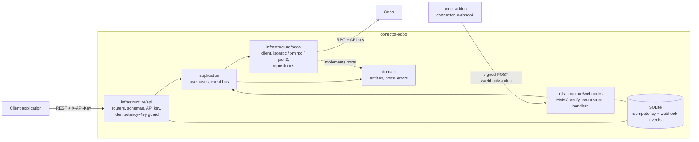

# conector-odoo

A FastAPI service that connects your applications to Odoo in both directions:

- **FastAPI -> Odoo**: a typed REST API over `res.partner` (customers), `product.product` and
  `sale.order`, backed by Odoo RPC (JSON-RPC, XML-RPC or JSON-2) with API-key authentication.
- **Odoo -> FastAPI**: HMAC-signed webhooks pushed by a small Odoo addon (`odoo_addon/`) when partners
  change or sale orders are confirmed.

Python 3.12 (3.11+), FastAPI, Pydantic v2, httpx, SQLite (idempotency), managed with
[uv](https://docs.astral.sh/uv/).

## Architecture



Layers (dependencies point inwards):

- `domain`: plain dataclasses (`Customer`, `Product`, `SaleOrder`, `OdooEvent`), the repository and
  event-bus ports, and domain errors. No framework imports.
- `application`: use cases (`CreateCustomer`, `ConfirmSaleOrder`, `HandleOdooEvent`, ...) and the
  in-process event bus. They only know the ports.
- `infrastructure/odoo`: the Odoo client (uid cache, re-auth, retries on network errors only, company
  context), the three transports and the repository adapters.
- `infrastructure/api`: FastAPI routers, Pydantic schemas, error handlers, `X-API-Key` auth and the
  `Idempotency-Key` guard.
- `infrastructure/webhooks` and `infrastructure/idempotency`: signature verification, the SQLite
  stores and background purge.

## Setup

### With uv

```bash
uv sync
cp .env.example .env          # then edit it (see the variable table below)
uv run uvicorn conector_odoo.main:create_app --factory --host 0.0.0.0 --port 8000
```

Interactive API docs: <http://localhost:8000/docs>.

### With Docker Compose

```bash
cp .env.example .env          # edit it; ODOO_URL must be reachable from the container
docker compose up -d --build
curl http://localhost:8000/health
```

Odoo is external: the compose file only runs the connector. The SQLite database lives in the named
volume `connector-data` mounted at `/app/data`. The image runs as a non-root user and its healthcheck
calls `/health`, which answers 503 (container `unhealthy`) while Odoo is unreachable.

## Configuration

All settings are environment variables (or entries in `.env`).

| Variable | Default | Description |
| --- | --- | --- |
| `ODOO_URL` | required | Base URL of Odoo, e.g. `https://odoo.example.com`. |
| `ODOO_DB` | required | Odoo database name. |
| `ODOO_USER` | required | Login of the Odoo user that owns the API key. |
| `ODOO_API_KEY` | required | Odoo API key, at least 16 characters. Used instead of a password. |
| `ODOO_PROTOCOL` | `jsonrpc` | `jsonrpc`, `xmlrpc` or `json2` (json2 needs Odoo 19). |
| `ODOO_TIMEOUT_SECONDS` | `10.0` | Per-request timeout towards Odoo. |
| `ODOO_MAX_RETRIES` | `2` | Retries on network errors for idempotent calls (never for `create`). |
| `ODOO_COMPANY_ID` | unset | Default company injected in the Odoo context (`allowed_company_ids`). |
| `ODOO_MAX_CONCURRENCY` | `8` | Max Odoo calls in flight at once (1-64). Also the HTTP connection pool size for `jsonrpc`/`json2`. |
| `ODOO_BATCH_SIZE` | `500` | Default page size for keyset iteration and chunked Odoo operations (1-5000). |
| `CONNECTOR_API_KEY` | unset | Key clients send in `X-API-Key`, at least 16 characters. If unset, the data endpoints are unauthenticated and a warning is logged at startup. |
| `WEBHOOK_SECRET` | required | Shared secret to verify Odoo webhooks, at least 16 characters. |
| `WEBHOOK_TOLERANCE_SECONDS` | `300` | Max clock skew between the signed timestamp and the connector clock. |
| `WEBHOOK_REDELIVERY_AFTER_SECONDS` | `60` | A received-but-unprocessed event is re-dispatched when Odoo redelivers it after this long. |
| `IDEMPOTENCY_DB_PATH` | `./data/idempotency.sqlite3` | SQLite file for idempotency keys and webhook events (the Docker image sets `/app/data/idempotency.sqlite3`). |
| `IDEMPOTENCY_IN_PROGRESS_TIMEOUT_SECONDS` | `300` | An in-progress key older than this is treated as abandoned (outcome unknown). |
| `IDEMPOTENCY_TTL_HOURS` | `24` | Stored keys and webhook events older than this are purged. |
| `IDEMPOTENCY_PURGE_INTERVAL_SECONDS` | `3600` | How often the purge runs. |
| `LOG_LEVEL` | `INFO` | Log level (JSON logs; secrets are redacted). |

`.env.example` must list every variable above (the repository owner keeps it in sync).

### Create an Odoo API key

1. In Odoo, open the user's Preferences > Account Security > **New API Key**.
2. Give it a description, confirm with your password, and copy the key (it is shown once).
3. Put it in `ODOO_API_KEY`; Odoo accepts it in place of the password, so the connector never needs
   one. Use a dedicated user with the minimum access rights it needs (contacts, products, sales).

### Protocols

| `ODOO_PROTOCOL` | Endpoint | Notes |
| --- | --- | --- |
| `jsonrpc` (default) | `/jsonrpc` | Works on every supported Odoo. |
| `xmlrpc` | `/xmlrpc/2/common` and `/xmlrpc/2/object` | Runs the blocking `xmlrpc.client` in a worker thread. |
| `json2` | `/json/2/<model>/<method>` | Odoo 19+. Bearer API key plus the `X-Odoo-Database` header, no session. |

JSON-2 has no uid. At startup the connector verifies the key with `res.users/context_get` (owner `uid`
in the context) against the `ODOO_USER` login. The `uid` entry of that response is not documented for
Odoo 19: if it is missing the connector logs a warning and falls back to the login lookup alone.
Verify this against your instance.

## API

Base URL `http://localhost:8000`. Data endpoints need `X-API-Key` when `CONNECTOR_API_KEY` is set;
`/health` and `/webhooks/odoo` never do.

```bash
KEY=your-connector-api-key

# health (public)
curl http://localhost:8000/health

# customers
curl -X POST http://localhost:8000/customers \
  -H "X-API-Key: $KEY" -H "Content-Type: application/json" -H "Idempotency-Key: create-ada-001" \
  -d '{"name": "Ada Lovelace", "email": "ada@example.com", "country_code": "GB", "is_company": false}'
curl -H "X-API-Key: $KEY" "http://localhost:8000/customers?email=ada@example.com&limit=10&offset=0"
curl -H "X-API-Key: $KEY" http://localhost:8000/customers/42
curl -X PATCH http://localhost:8000/customers/42 \
  -H "X-API-Key: $KEY" -H "Content-Type: application/json" -d '{"phone": "+44 20 7946 0000"}'

# products (read only)
curl -H "X-API-Key: $KEY" "http://localhost:8000/products?limit=20"
curl -H "X-API-Key: $KEY" http://localhost:8000/products/7

# sale orders
curl -X POST http://localhost:8000/sale-orders \
  -H "X-API-Key: $KEY" -H "Content-Type: application/json" -H "Idempotency-Key: order-2024-0001" \
  -d '{"customer_id": 42, "lines": [{"product_id": 7, "quantity": 2, "price_unit": 19.9}]}'
curl -H "X-API-Key: $KEY" http://localhost:8000/sale-orders/15
curl -X POST "http://localhost:8000/sale-orders/15/confirm" \
  -H "X-API-Key: $KEY" -H "Idempotency-Key: confirm-15"
```

`company_id` (query parameter on `GET /sale-orders/{id}` and `POST /sale-orders/{id}/confirm`, body field
on `POST /sale-orders`) selects the Odoo company context for that call.

### Errors

Errors are JSON: `{"error": "<code>", "detail": "<message>"}`.

| Status | `error` | Meaning |
| --- | --- | --- |
| 401 | `unauthorized` / `odoo_auth_error` / `invalid_signature` | Missing or wrong `X-API-Key`, Odoo rejected the connector's key, or a bad webhook signature. |
| 403 | `permission_denied` | The Odoo user lacks access rights for the operation. |
| 404 | `not_found` | The record does not exist. |
| 409 | `idempotency_in_progress` / `idempotency_outcome_unknown` | See idempotency below. |
| 422 | `validation_error` / `idempotency_key_reused` | Invalid input (also Odoo validation errors), or the key was reused with another request. |
| 202 | `created_but_unreadable` | The record WAS created in Odoo but could not be read back; the body carries `id` and `model`, and `Location` points to the resource. Do not retry the create. |
| 502 | `odoo_unavailable` / `connector_error` | Odoo unreachable, timed out or returned a server error. |
| 502 | `batch_partially_applied` | A chunked create failed after earlier chunks were created. The body adds `created_ids` (what exists in Odoo, in input order) and `failed_chunk`; do not blindly retry. |
| 503 | `idempotency_store_unavailable` / `webhook_store_unavailable` | The local SQLite store failed; the action was not executed. `/health` also answers 503 `degraded` when Odoo is down. |

### Idempotency

`Idempotency-Key` (optional, max 255 characters) is accepted on `POST /customers`, `POST /sale-orders`
and `POST /sale-orders/{id}/confirm`.

- Same key and same request: the first response is stored and replayed with `Idempotent-Replayed: true`.
- Same key, different request: 422 `idempotency_key_reused`.
- A request still running: 409 `idempotency_in_progress`.
- If the write may have been applied (Odoo timeout, 5xx, unexpected error), the key is marked
  `unknown`: a retry gets 409 `idempotency_outcome_unknown`. Check Odoo, then use a new key. The
  connector never blindly re-runs a `create`.
- Errors that guarantee nothing was written (validation, not found, auth, permission) release the key
  so you can retry with it.
- Keys are scoped per endpoint and purged after `IDEMPOTENCY_TTL_HOURS`.

## Webhooks (Odoo -> connector)

`POST /webhooks/odoo` is authenticated by an HMAC signature, not by `X-API-Key`. Headers:

```
X-Odoo-Timestamp: <unix seconds>
X-Odoo-Signature: sha256=<lowercase hex>
signature = HMAC-SHA256(WEBHOOK_SECRET, f"{timestamp}." + raw_body)
```

The body is JSON: `{"event_id": "<uuid>", "event_type": "partner.created", "model": "res.partner",
"record_id": 7, "occurred_at": "<ISO-8601>", "payload": {...}}`. Event types: `partner.created`,
`partner.updated`, `sale_order.confirmed` (others are acknowledged and ignored). The signature covers
the raw bytes, so sign exactly what you send. Requests more than `WEBHOOK_TOLERANCE_SECONDS` away from
the connector's clock are rejected (401).

Send a signed test event:

```bash
SECRET=your-webhook-secret
BODY='{"event_id":"'$(python3 -c 'import uuid;print(uuid.uuid4())')'","event_type":"partner.created","model":"res.partner","record_id":7,"occurred_at":"2026-01-01T00:00:00+00:00","payload":{"name":"Ada"}}'
TS=$(date +%s)
SIG=$(printf '%s.%s' "$TS" "$BODY" | openssl dgst -sha256 -hmac "$SECRET" -hex | sed 's/^.* //')
curl -i -X POST http://localhost:8000/webhooks/odoo \
  -H "Content-Type: application/json" -H "X-Odoo-Timestamp: $TS" -H "X-Odoo-Signature: sha256=$SIG" \
  --data-binary "$BODY"
```

Python equivalent of the signature: `hmac.new(secret.encode(), f"{ts}.".encode() + body, "sha256").hexdigest()`.

Responses: 202 `accepted` (dispatched to the in-process event bus), 200 `duplicate`, 202 `ignored`
(unknown type), 401, 413 (body over 1 MiB), 422.

**Delivery is at-least-once.** The event id is stored as `received` before dispatch and marked
`processed` only after every handler succeeded. If a handler fails or the process dies, Odoo's redelivery
after `WEBHOOK_REDELIVERY_AFTER_SECONDS` runs the handlers again; redeliveries of processed (or still
in-flight) events are acknowledged with 200. Handlers must therefore be idempotent. Add your own with
`app.state.container.event_bus.subscribe("partner.created", handler)`.

### Odoo addon

`odoo_addon/connector_webhook/` posts the events above from Odoo 17+ (partner created/updated, sale
order confirmed). Install steps, system parameters and version caveats are in
[odoo_addon/connector_webhook/README.md](odoo_addon/connector_webhook/README.md).

## Large data volumes

The Odoo client is built to move many records without loading everything at once.

- **Keyset pagination.** `OdooClient.iter_search_read` walks a model in batches ordered by `id`:
  each batch is `search_read(domain + [id > last_id], limit=batch_size, order="id asc")`. Unlike
  `offset`, the cost of a batch does not grow with its position and concurrent inserts or deletes
  cannot shift the window. Only one batch is in memory at a time. `batch_size` is 1-5000 (default
  `ODOO_BATCH_SIZE`).
- **Chunked operations.** `read_many` (keeps input order, skips missing ids), `write_many` and
  `create_many` split big lists into chunks (500, 500 and 100 by default). `create_many` uses Odoo
  multi-create (one `create` call per chunk with a list of values).
- **No blind retries.** Each `create` chunk is a separate non-idempotent call: it is never retried.
  If a later chunk fails, the client raises `BatchPartiallyApplied` carrying the ids already created
  and the failed chunk index. Over HTTP this is a `502` `batch_partially_applied` response with
  `created_ids`; the records in `created_ids` exist in Odoo.
- **Concurrency limit.** `ODOO_MAX_CONCURRENCY` caps in-flight Odoo calls across the whole process
  (semaphore) and sizes the HTTP connection pool. Raise it for throughput if Odoo has spare workers;
  lower it to protect a small Odoo instance. Excess calls wait, they are not rejected.

## Development

```bash
uv sync
uv run pytest -q
uv run ruff check .
uv run ruff format --check .
uv run mypy src
```

The project follows strict TDD (failing test first) and Conventional Commits.
