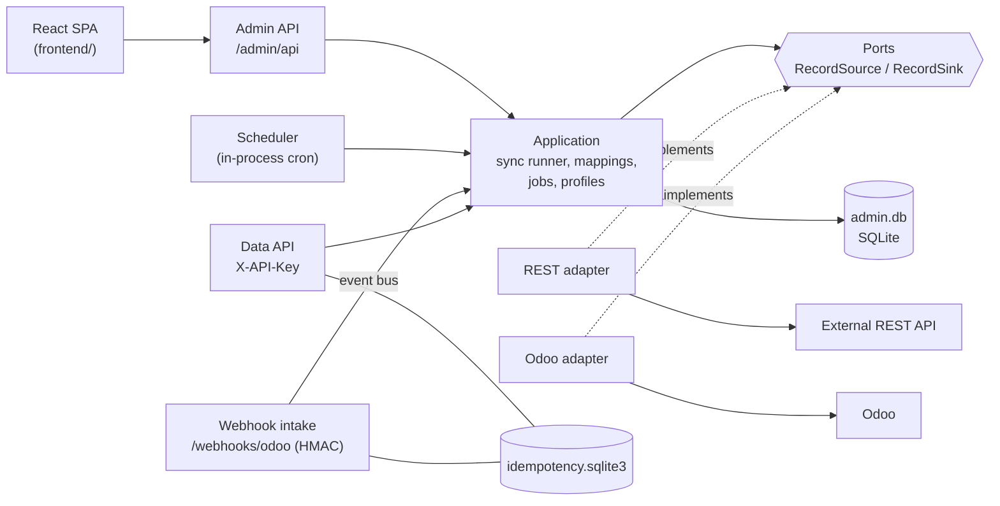
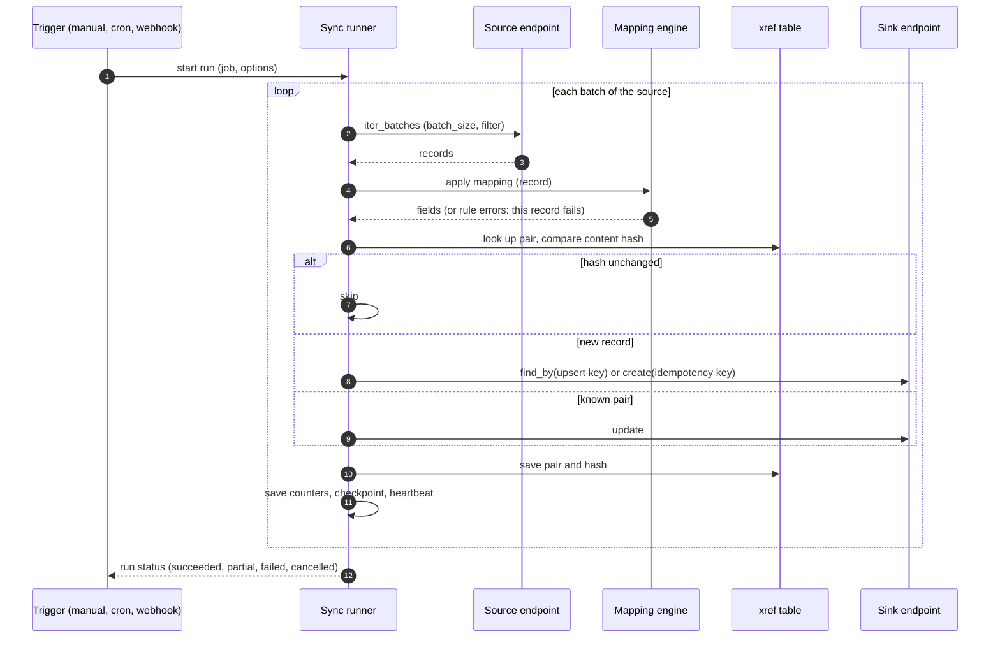

# conector-odoo

A FastAPI service that syncs Odoo with arbitrary REST APIs, managed from a web admin UI. You define
**connections** (Odoo or REST), **resources** (REST collections), **mappings** (field rules with
transforms) and **jobs** (manual, cron or webhook triggered); the service runs them idempotently and
keeps a history of runs and per-record errors. The first target is the SUWE API.

The original capabilities are untouched: a typed FastAPI -> Odoo data API (`X-API-Key`) for customers,
products and sale orders, and HMAC-signed Odoo -> connector webhooks. See [docs/data-api.md](docs/data-api.md).

Stack: Python 3.11+ (3.12 in Docker), FastAPI, Pydantic v2, httpx, SQLite, React 19 + Vite + Tailwind
(admin UI, Spanish by default, English available), managed with [uv](https://docs.astral.sh/uv/) and npm.

## Architecture

Hexagonal: the sync runner only knows the ports `RecordSource` / `RecordSink`; the REST and Odoo
adapters implement them. More detail and a module map: [docs/architecture.md](docs/architecture.md).



One sync run:



Idempotency: a create carries the key `sync:{job_id}:{source_id}:{content_hash}`, the cross-reference
(xref) table pairs source and destination ids, and a record whose content hash did not change is
skipped. Re-running an unchanged job writes nothing. A bad record is stored in the run's error list
and the run continues.

## Quick start (local development)

Prerequisites: Python with [uv](https://docs.astral.sh/uv/), Node 20+. The service needs an Odoo
instance for the `ODOO_*` settings (they are required even if you only use the admin UI).

```bash
# 1. Backend
uv sync
cp .env.example .env
uv run python -c "from cryptography.fernet import Fernet; print(Fernet.generate_key().decode())"
```

Edit `.env`: set `ODOO_URL`, `ODOO_DB`, `ODOO_USER`, `ODOO_API_KEY`, `WEBHOOK_SECRET`, paste the
generated key into `ENCRYPTION_KEY`, and add the first admin plus plain-HTTP cookies for local use:

```bash
ADMIN_BOOTSTRAP_USER=admin
ADMIN_BOOTSTRAP_PASSWORD=choose-a-password-of-12-or-more-chars
ADMIN_COOKIE_SECURE=false
```

```bash
uv run uvicorn conector_odoo.main:create_app --factory --host 0.0.0.0 --port 8000
```

```bash
# 2. Frontend dev server (hot reload; proxies /admin/api to the backend)
cd frontend
npm ci
npm run dev                   # http://localhost:5173 ; VITE_BACKEND_URL overrides http://localhost:8000
```

Sign in with the bootstrap user. The first admin is created only when no admin exists, so the two
`ADMIN_BOOTSTRAP_*` variables can be removed afterwards. More users: **Ajustes** > **Usuarios**.

To serve the UI from the backend itself (no dev server): `npm run build` in `frontend/`, then open
<http://localhost:8000/>. The backend serves `FRONTEND_DIST_DIR` (default `./frontend/dist`, relative
to the working directory); if it is missing, the API still works and one warning is logged.

API docs of the data API: <http://localhost:8000/docs>.

### Docker

One image serves the API and the admin UI: a Node stage builds `frontend/`, a Python 3.12 stage
installs the locked dependencies with uv, and the runtime runs as a non-root user under `tini`.
Odoo and the target REST API are **not** bundled; point the connector at them.

```bash
cp .env.example .env
# Generate the vault key and paste it as ENCRYPTION_KEY:
python -c "from cryptography.fernet import Fernet; print(Fernet.generate_key().decode())"
# Edit .env: ODOO_*, WEBHOOK_SECRET, ENCRYPTION_KEY, ADMIN_BOOTSTRAP_USER/PASSWORD

docker compose up -d --build
docker compose logs -f connector
docker compose down          # keeps the data volume; add -v to delete it
```

The admin UI is at <http://localhost:8000/> (change the host port with `CONNECTOR_PORT`).
Compose refuses to start while `ODOO_URL`, `ODOO_DB`, `ODOO_USER`, `ODOO_API_KEY`,
`WEBHOOK_SECRET`, `ENCRYPTION_KEY` or `ADMIN_BOOTSTRAP_*` are unset.

- **Cookie and TLS.** `ADMIN_COOKIE_SECURE` defaults to `true`, so browsers only send the session
  cookie over HTTPS (localhost is exempt). Put a reverse proxy that terminates TLS in front of
  port 8000 for any real deployment. Set `ADMIN_COOKIE_SECURE=false` only for plain-HTTP local use.
- **Data.** Both SQLite databases (`admin.db`, `idempotency.sqlite3`) live on the named volume
  `connector-data` mounted at `/app/data`. Back it up while the stack is stopped or idle:
  `docker run --rm --user 0 --entrypoint tar -v conector-odoo_connector-data:/data:ro -v "$PWD":/backup conector-odoo:latest czf /backup/connector-data.tgz -C /data .`
  (the volume is named `<compose project>_connector-data`; check `docker volume ls`).
  Keep `ENCRYPTION_KEY` with the backup: without it stored secrets cannot be decrypted.
- **Health.** The container healthcheck calls `GET /livez` (process only). `GET /health` also
  calls Odoo and answers 503 when it is down, so it is not used as the liveness probe.
- **Reaching Odoo or the SUWE fake on the Docker host.** `localhost` inside the container is the
  container itself. Use `http://host.docker.internal:8069` (Odoo) or
  `http://host.docker.internal:8000` (SUWE fake) in `ODOO_URL` and in the connection profiles;
  compose maps that name to the host gateway through `extra_hosts`, which also works on Linux.
- **Single replica.** Run one container: the scheduler is in-process and SQLite is local. Set
  `SYNC_SCHEDULER_ENABLED=false` to disable cron jobs.

## Configuration

Environment variables or entries in `.env` (source: `src/conector_odoo/config.py`). Secrets must be
at least 16 characters where noted.

### Odoo (data API and webhook handlers)

| Variable | Default | Description |
| --- | --- | --- |
| `ODOO_URL` | required | Base URL of Odoo. |
| `ODOO_DB` | required | Odoo database name. |
| `ODOO_USER` | required | Login of the user that owns the API key. |
| `ODOO_API_KEY` | required | Odoo API key, 16+ characters. |
| `ODOO_PROTOCOL` | `jsonrpc` | `jsonrpc`, `xmlrpc` or `json2` (Odoo 19). |
| `ODOO_TIMEOUT_SECONDS` | `10.0` | Per-request timeout. |
| `ODOO_MAX_RETRIES` | `2` | Retries on network errors for idempotent calls (never for `create`). |
| `ODOO_COMPANY_ID` | unset | Default company in the Odoo context. |
| `ODOO_MAX_CONCURRENCY` | `8` | Max Odoo calls in flight (1-64). |
| `ODOO_BATCH_SIZE` | `500` | Page size of keyset iteration (1-5000). |
| `BULK_MAX_ITEMS` | `1000` | Max items per `POST /customers/bulk` (1-10000). |
| `CONNECTOR_API_KEY` | unset | Key clients send in `X-API-Key` (16+). If unset, data endpoints are unauthenticated and a warning is logged. |

### Webhooks and idempotency

| Variable | Default | Description |
| --- | --- | --- |
| `WEBHOOK_SECRET` | required | HMAC secret for `/webhooks/odoo`, 16+ characters. |
| `WEBHOOK_TOLERANCE_SECONDS` | `300` | Max clock skew of the signed timestamp. |
| `WEBHOOK_REDELIVERY_AFTER_SECONDS` | `60` | A received-but-unprocessed event is re-dispatched after this long. |
| `IDEMPOTENCY_DB_PATH` | `./data/idempotency.sqlite3` | SQLite file for idempotency keys and webhook events. |
| `IDEMPOTENCY_IN_PROGRESS_TIMEOUT_SECONDS` | `300` | An older in-progress key is treated as abandoned. |
| `IDEMPOTENCY_TTL_HOURS` | `24` | Keys and events older than this are purged. |
| `IDEMPOTENCY_PURGE_INTERVAL_SECONDS` | `3600` | Purge interval. |

### Admin UI and sync

| Variable | Default | Description |
| --- | --- | --- |
| `ENCRYPTION_KEY` | unset | Fernet key for connection secrets. Without it, storing or reading a secret fails with a clear error. |
| `ADMIN_DB_PATH` | `./data/admin.db` | SQLite file for connections, mappings, jobs, runs and users (migrated at startup). |
| `FRONTEND_DIST_DIR` | `./frontend/dist` | Built UI served at `/`. |
| `SYNC_SCHEDULER_ENABLED` | `true` | Run cron jobs in-process. Set `false` to disable. |
| `SYNC_SCHEDULER_REFRESH_SECONDS` | `60.0` | How often the scheduler reloads the job list (> 0). |
| `ADMIN_BOOTSTRAP_USER` / `ADMIN_BOOTSTRAP_PASSWORD` | unset | First admin, created only when no admin exists. Set both or neither; password 12+ characters. |
| `ADMIN_COOKIE_NAME` | `admin_session` | Session cookie name. |
| `ADMIN_COOKIE_SECURE` | `true` | Send the cookie over HTTPS only. Set `false` for plain-HTTP development. |
| `ADMIN_COOKIE_SAMESITE` | `lax` | `lax` or `strict`. |
| `ADMIN_SESSION_TTL_SECONDS` | `43200` | Absolute session lifetime (12 h, min 60). |
| `ADMIN_SESSION_IDLE_SECONDS` | `7200` | Idle timeout (2 h, min 60). |
| `ADMIN_LOGIN_MAX_FAILURES` | `5` | Failed logins per username before lockout. |
| `ADMIN_LOGIN_LOCKOUT_SECONDS` | `900` | Lockout duration. |
| `ADMIN_ARGON2_TIME_COST` / `ADMIN_ARGON2_MEMORY_KIB` / `ADMIN_ARGON2_PARALLELISM` | `3` / `65536` / `4` | Argon2id cost. Lower only on tiny hosts or in tests. |
| `LOG_LEVEL` | `INFO` | JSON logs; secrets are redacted. |

## Security

| Area | What is done |
| --- | --- |
| Passwords | argon2id hashes; minimum 12 characters; no default account. |
| Sessions | Server-side. Only the SHA-256 of the cookie token is stored. Absolute TTL 12 h, idle 2 h. A new token on every login; password change, role change or user deletion revokes the user's sessions. |
| Cookie | `admin_session`: HttpOnly, `SameSite=Lax`, `Secure` by default, `Path=/admin/api`; responses are `Cache-Control: no-store`. |
| CSRF | A per-session token returned by login and `/auth/me` must be sent as `X-CSRF-Token` on every non-GET request. |
| Roles | `admin` (everything) and `operator` (read-only). One router-level guard denies by default; a test walks the OpenAPI route table and fails if a route answers anonymous callers, lets an operator mutate, or skips CSRF. Anything that contacts a remote system with stored credentials (test, preview, discover, import, dry-run) is a POST, so operators cannot trigger it. Every user may change their own password. |
| Lockout | 5 failed logins per username lock it for 15 minutes (429 + `Retry-After`). Unknown usernames are throttled the same way and verify against a dummy hash, so message, status and timing match. |
| Secret vault | Connection secrets are encrypted with Fernet (`ENCRYPTION_KEY`) before they reach SQLite. They are write-only: the API returns `has_secret` flags, never values. No key is generated implicitly. |
| Webhooks | `X-Odoo-Signature` = HMAC-SHA256 over `timestamp.body`, constant-time compare, timestamp tolerance, event-id deduplication. |
| OpenAPI import | http/https only, 5 MB cap, YAML via `safe_load`, local `$ref` only. Redirects are followed by hand: max 3 hops, same host only, never https to http. |

Key loss: if `ENCRYPTION_KEY` is lost or changed, every stored secret becomes undecryptable
(`VaultDecryptionError`) and each connection must be re-entered. Back the key up separately from the
database. There is no key-rotation tool: rotating means re-entering all secrets under the new key.

Not done, by design or yet:

- **No per-IP throttling**; lockout is per username only.
- **TLS is expected at a reverse proxy.** The service speaks plain HTTP. The `Secure` cookie default
  means the UI only works over HTTPS (or on localhost) unless you set `ADMIN_COOKIE_SECURE=false`.
- **No SSRF blocklist.** An admin can point a connection or an OpenAPI import at any host, including
  internal ones; the first URL is the admin's choice. Only admins can do this.
- No account unlock action or locked-account indicator in the UI.

## Usage walkthrough

Follow the sidebar order in the UI. Operators see everything but cannot change anything.

1. **Connections.** Create a REST connection (base URL, auth: API key, Bearer, OAuth2 client
   credentials or OIDC) and an Odoo connection (URL, database, login, API key). The wizard tests each
   step (URL, reachability, TLS, auth) before you save. Secrets are write-only.
2. **Resources.** A resource describes one REST collection: list endpoint, `items_path`, `id_field`
   and pagination (`none`, `page`, `offset` or `cursor`). Create it by hand or import candidates from
   an OpenAPI 3.x / Swagger 2.0 document, then check it with the live preview. Odoo models need no
   catalog entry; they are discovered from the instance (any model, fields via `fields_get`).
3. **Mappings.** One rule per target field. An expression is `direct` (a source field), `constant`,
   `concat` or `transform` (an input plus ordered steps). Steps: `trim`, `upper`, `lower`, `title`,
   `to_string`, `to_number`, `to_int`, `to_bool`, `replace`, `default`, `date_format`, `to_cents`,
   `from_cents`, `lookup`, `coalesce`, `substring`. Every save creates a version; the editor offers
   suggestions and a dry run against live sample records.
4. **Jobs.** A job pairs two resources and a mapping, plus an upsert key (for example `field:ref`),
   a direction (`a_to_b`, `b_to_a`, `bidirectional`, the last two need a reverse mapping), a conflict
   rule and a batch size. Triggers: manual, schedule (5-field numeric cron, **UTC**) or webhook
   (event types such as `partner.updated`). "Save and simulate" saves the job, then dry-runs it.
5. **Runs.** History with counters, status, per-record errors (payloads redacted), the checkpoint and
   actions: cancel, resume, retry failed records. The dashboard highlights failures and stale runs.

### Example: SUWE clients -> Odoo partners

The Playwright suite automates exactly this flow ([e2e/README.md](e2e/README.md)): a REST connection to
the SUWE API (Bearer dummy token against the fake), a resource `clients` (list
`/organization/clients`, `id_field` `uuid`, `items_path` `items`, `page` pagination with
`total_pages_path` `total_pages`), a mapping to `res.partner` (`name`, `ref` <- `uuid`, `vat` <-
`tax_id`, `city`, `street` <- `address`) and a manual job with upsert key `ref`. A second run creates
nothing.

**Open blocker for production.** The SUWE fake accepts no credentials, and its fake OIDC server has no
`client_credentials` or `password` grant (it answers `unsupported_grant_type`), so a machine-to-machine
token flow could not be verified. The real SUWE (Authentik) service-token flow is unconfirmed. Options:

- (a) a `client_credentials` grant or service account on the real SUWE;
- (b) a static API key or long-lived token issued by SUWE (works today as API key or Bearer);
- (c) a refresh-token flow after one interactive login (not implemented).

## Adding a target API

1. **Connection**: choose type REST, enter the base URL and an auth method, run the wizard test.
2. **Resource**: set the list endpoint, `items_path`, `id_field`, and the pagination strategy with its
   parameter names. Optional get/create/update endpoints are needed only when the API is written to.
   Verify with the preview.
3. **Mapping**: pick source and target sides, add rules, and run the dry run until it is clean.
4. **Job**: choose direction, upsert key and trigger. Use "Save and simulate", then run it.
5. Check the run, fix the errors listed, and use "retry failed" for retryable ones.

### For developers

| To add | Where |
| --- | --- |
| A mapping transform | A dataclass in `domain/mapping.py` (add it to the `Step` union), its name and parameters in the registry of `domain/mapping_codec.py`, evaluation in `_apply_step` of `domain/mapping_engine.py`, checks in `domain/mapping_validation.py`, then the frontend editor (`frontend/src/features/mappings/`) and i18n keys in `es.ts` and `en.ts`. |
| An auth type | A member of `AuthMethod` in `domain/profiles.py`, an `Authenticator` in `infrastructure/rest/auth.py` wired in `build_authenticator`, the probe in `infrastructure/profiles/rest_probe.py`, and the connection wizard. |
| A pagination strategy | `PaginationStrategy` in `domain/resources.py`, the loop in `infrastructure/rest/endpoint.py`, validation in `domain/resource_codec.py`, the resource form. |
| A new kind of system (not REST/Odoo) | Implement `RecordSource` / `RecordSink` (see `domain/ports.py`) and build it in `infrastructure/endpoints.py`. |
| A new admin route | Add the router in `infrastructure/admin_api/routers/` and include it in the `protected` group of `admin_api/router.py` (deny by default). `tests/admin_api/test_roles.py` enforces the role matrix. |

Layer rule: `domain` imports no framework; every new capability enters through a port.

## Testing

```bash
uv sync
uv run pytest -q                      # backend; tests marked `integration` skip when the SUWE fake is down
uv run pytest -m integration          # only the tests that need the SUWE fake on :8000
uv run ruff check . && uv run ruff format --check .
uv run mypy src

cd frontend
npm test                              # vitest (jsdom + Testing Library)
npm run lint && npm run typecheck && npm run build
```

End-to-end (Playwright, real UI against the built frontend, fake Odoo, external SUWE fake):
[e2e/README.md](e2e/README.md). The project follows strict TDD and Conventional Commits.

## Known limitations

- REST `GET` requests are **not retried on 429 or 5xx**, by design: only network errors are retried,
  and only for idempotent calls or calls that carry an idempotency key.
- **No automatic incremental sync.** There is no automatic `since`; every run re-reads the source and
  relies on the content hash to skip unchanged records. `since` exists only as a manual job filter.
- The resource **catalog is REST-only**; Odoo models are addressed by technical name.
- **Dry run works for saved jobs only** (the mapping editor also dry-runs on sample records).
- A mapping stores resource names, not connections: pick the connection again when editing a mapping.
- Mapping `None` values are omitted, never sent as `null`; clearing a remote field needs an explicit
  constant or default.
- Resume skips up to the checkpoint id (sources have no remote cursor); the reverse pass of a
  bidirectional job ignores the job filter.
- The scheduler is in-process: missed ticks are not caught up after a restart, and a multi-instance
  deployment would run each job once per instance. Use a single replica.
- The connection list shows test results from the current page session only; draft tests on edit
  need secrets retyped.
- The UI has no app-version or scheduler status panel, and the frontend has not had a colour-contrast
  audit.
