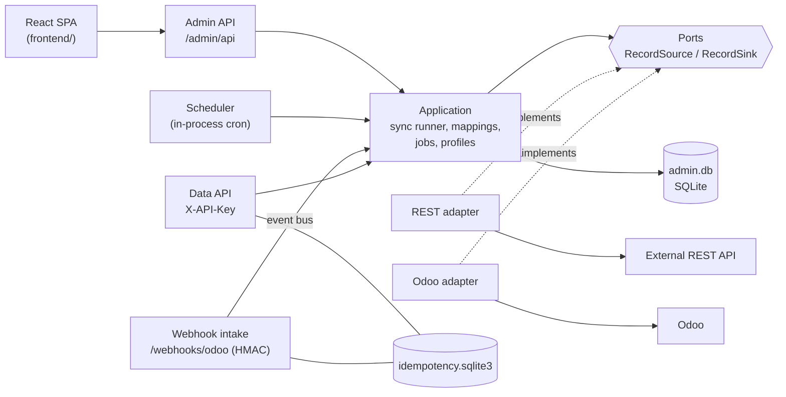
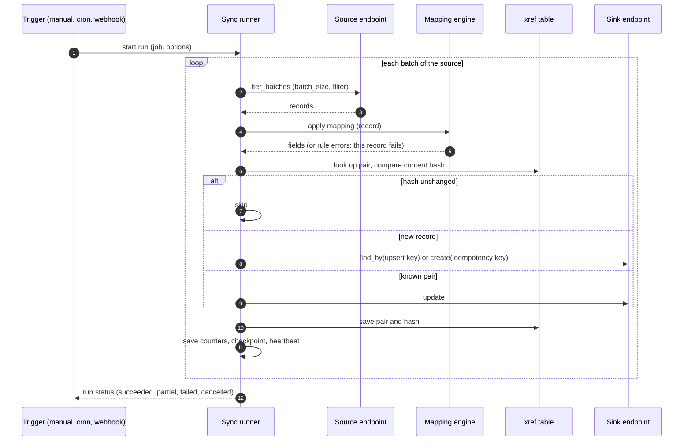

# Architecture

Hexagonal: the domain and the application layer know only ports; adapters implement them.
Back to the [README](../README.md).

## Component view

Reading guide:

- Entry points (left) never talk to adapters directly; they call application use cases.
- `RecordSource` (`describe`, `iter_batches`, `get`, `sample`) and `RecordSink` (`describe`,
  `find_by`, `create`, `update`) are `Protocol`s in `domain/ports.py`. `RecordEndpoint` is both.
  Every Odoo model and every REST resource is just another endpoint, so the sync runner is generic.
- The runner gets endpoints from `ProfileEndpoints` (`infrastructure/endpoints.py`), which builds
  them from a stored connection profile and decrypts its secrets with the vault.
- The data API (customers, products, sale orders) is the original, Odoo-only part of the service. It
  keeps its own repositories and the idempotency store; see [data-api.md](data-api.md).

## One sync run

Rules the runner follows (full algorithm in the docstring of `application/sync_runner.py`):

| Concern | Behaviour |
| --- | --- |
| Idempotency | A create carries the key `sync:{job_id}:{source_id}:{content_hash}`; a record whose hash equals the stored one is skipped, so re-running an unchanged job writes nothing. |
| Adoption | With an upsert key `field:<name>`, an existing destination record that matches is adopted (updated, xref written) instead of duplicated. |
| Errors | A bad record (mapping error, remote rejection) is stored in `run_errors` with a redacted payload and a retryable flag; the run continues. An auth error, a missing resource or too many errors fails the whole run. |
| Resume | After every batch the counters, checkpoint and heartbeat are saved. A failed, cancelled or stale (no heartbeat for 15 minutes) run can be resumed; failed records can be retried. |
| Bidirectional | Forward pass A to B, then reverse pass B to A. Two hashes per pair prevent echo; a change on both sides is resolved by the conflict rule (`source_wins`, `target_wins`, `newest_wins`, `flag_conflict`). |
| Dry run | Reads only: no destination writes, no xref writes; counters mean would-create / would-update / would-skip. |

## Module map

| Layer | Path | Holds |
| --- | --- | --- |
| Domain | `src/conector_odoo/domain/` | Records, ports, mapping model and engine, cron evaluator, sync job and run model, errors. No framework imports. |
| Application | `src/conector_odoo/application/` | Use cases: sync runner, run launcher, scheduler, webhook triggers, mappings, jobs, profiles, auth, dashboard, plus the legacy customer, product and sale-order use cases. |
| REST adapter | `infrastructure/rest/` | Pagination, auth (API key, bearer, OAuth2 client credentials, OIDC), retries, error normalisation. |
| Odoo adapters | `infrastructure/odoo/` | Client with three transports; `records.py` is the model-generic endpoint, the other repositories serve the data API. |
| Persistence | `infrastructure/{profiles,resources,mappings,sync,auth,migrations}/` | SQLite repositories, the secret vault and the versioned migrator. |
| Admin API | `infrastructure/admin_api/` | `/admin/api` routers, sessions, CSRF, roles. |
| Static UI | `infrastructure/api/static_frontend.py` | Serves `frontend/dist` with an SPA fallback. |
