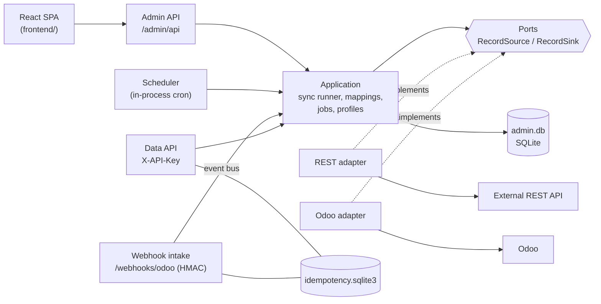
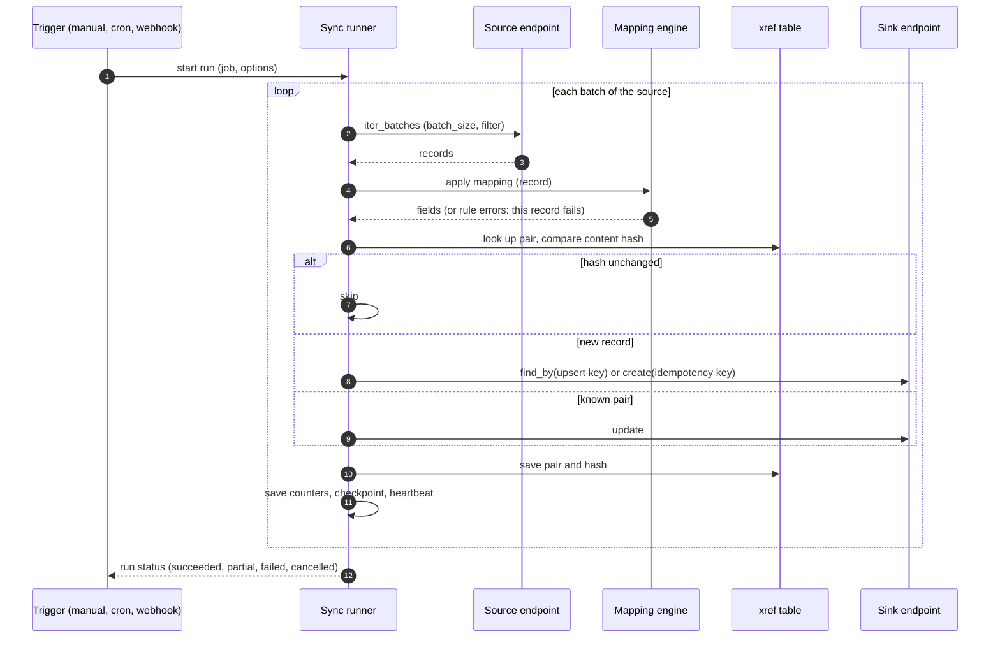

# Architecture

Hexagonal: the domain and the application layer know only ports; adapters implement them.
Back to the [README](../README.md).

## Component view



Reading guide:

- Entry points (left) never talk to adapters directly; they call application use cases.
- `RecordSource` (`describe`, `iter_batches`, `get`, `sample`) and `RecordSink` (`describe`,
  `find_by`, `create`, `update`) are `Protocol`s in `domain/ports.py`. `RecordEndpoint` is both.
  Every Odoo model and every REST resource is just another endpoint, so the sync runner is generic.
- The runner gets endpoints from `ProfileEndpoints` (`infrastructure/endpoints.py`), which builds
  them from a stored connection profile and decrypts its secrets with the vault.
- The data API (customers, products, sale orders) is the original, Odoo-only part of the service. It
  keeps its own repositories and the idempotency store; see [data-api.md](data-api.md).

## The active Odoo connection

The data API does not own a fixed Odoo client. `Container.odoo` is an `OdooConnectionProvider`
(`infrastructure/odoo/provider.py`) that holds the current `OdooClient` and the legacy repositories
built on it, and can be swapped while the service runs. The decision logic is the
`ActiveOdooConnection` use case (`application/active_odoo.py`), which talks only to ports
(`OdooRuntime`, `AppSettingsRepository`, `ConnectionProbe`, `SecretVault`).

```mermaid
sequenceDiagram
    autonumber
    participant A as Admin (PUT /admin/api/odoo/active)
    participant U as ActiveOdooConnection
    participant P as OdooConnectionProvider
    participant D as app_settings (SQLite)
    participant Q as Data API request
    A->>U: activate(profile_id)
    U->>P: prepare_profile (build client, no I/O)
    U->>U: probe the profile (url, reachable, tls, auth)
    alt probe fails
        U->>P: discard candidate
        U-->>A: 422 odoo_activation_failed (failing step); old connection untouched
    else probe passes
        U->>D: persist active profile + last_connected_at
        U->>P: commit (atomic swap)
        P->>P: retire old client, close it after its last lease
        U-->>A: 200 new status
    end
    Q->>P: acquire lease (per request, kept until the response ends)
    P-->>Q: current connection, or 503 odoo_not_configured
```

- **Leases.** Every legacy request takes a lease (`get_odoo_lease`, a yield dependency that lasts
  until the response, streamed exports included). A swap installs the new connection in one
  synchronous step, so no request sees a half-built client; the retired client is closed when its
  last lease is released (or at once if idle). Shutdown closes everything.
- **Startup resolution.** Active profile in `app_settings` (it must still exist, be an Odoo profile
  and decrypt) > legacy `ODOO_*` when all four are set (source `env`) > none. A broken active
  profile becomes a warning and a fallback, never a startup failure. No probe runs at startup.
- **Persistence.** Migration 7 adds `app_settings(key, value, updated_at)`. Keys:
  `odoo.active_profile_id`, `odoo.last_connected_at`, `odoo.last_connected_profile_id` and
  `odoo.profile.<id>.last_connected_at`. Deleting the active profile is refused (409).
- **Scope.** This connection serves only the legacy data API and `/health`. Sync jobs keep using
  the profiles they name, through `ProfileEndpoints`, independent of which profile is active.

## One sync run



Rules the runner follows (full algorithm in the docstring of `application/sync_runner.py`):

| Concern | Behaviour |
| --- | --- |
| Idempotency | A create carries the key `sync:{job_id}:{source_id}:{content_hash}`; a record whose hash equals the stored one is skipped, so re-running an unchanged job writes nothing. |
| Adoption | With an upsert key `field:<name>`, an existing destination record that matches is adopted (updated, xref written) instead of duplicated. |
| Errors | A bad record (mapping error, remote rejection) is stored in `run_errors` with a redacted payload and a retryable flag; the run continues. An auth error, a missing resource or too many errors fails the whole run. |
| Resume | After every batch the counters, checkpoint and heartbeat are saved. A failed, cancelled or stale (no heartbeat for 15 minutes) run can be resumed; failed records can be retried. |
| Bidirectional | Forward pass A to B, then reverse pass B to A. Two hashes per pair prevent echo; a change on both sides is resolved by the conflict rule (`source_wins`, `target_wins`, `newest_wins`, `flag_conflict`). |
| Dry run | Reads only: no destination writes, no xref writes; counters mean would-create / would-update / would-skip. |

## Module map

| Layer | Path | Holds |
| --- | --- | --- |
| Domain | `src/conector_odoo/domain/` | Records, ports, mapping model and engine, cron evaluator, sync job and run model, errors. No framework imports. |
| Application | `src/conector_odoo/application/` | Use cases: sync runner, run launcher, scheduler, webhook triggers, mappings, jobs, profiles, auth, dashboard, plus the legacy customer, product and sale-order use cases. |
| REST adapter | `infrastructure/rest/` | Pagination, auth (API key, bearer, OAuth2 client credentials, OIDC), retries, error normalisation. |
| Odoo adapters | `infrastructure/odoo/` | Client with three transports; `records.py` is the model-generic endpoint, the other repositories serve the data API. |
| Persistence | `infrastructure/{profiles,resources,mappings,sync,auth,migrations}/` | SQLite repositories, the secret vault (Fernet with `MultiFernet` key rotation, `profiles/rotation.py`) and the versioned migrator. |
| Management CLI | `src/conector_odoo/manage.py` | `python -m conector_odoo.manage check-vault \| rotate-vault-key`. |
| Outbound policy | `domain/outbound.py`, `infrastructure/net/guard.py` | Pure SSRF rules (blocked address classes, `default`/`strict`) and the httpcore network backend that resolves a host once, validates every address and connects to the validated IP (Host and SNI untouched). Every client built from a user-supplied URL (REST, token and issuer URLs, probes, OpenAPI import, Odoo profiles) goes through it. |
| Admin API | `infrastructure/admin_api/` | `/admin/api` routers, sessions, CSRF, roles, per-username and per-address login throttling. |
| Static UI | `infrastructure/api/static_frontend.py` | Serves `frontend/dist` with an SPA fallback. |
